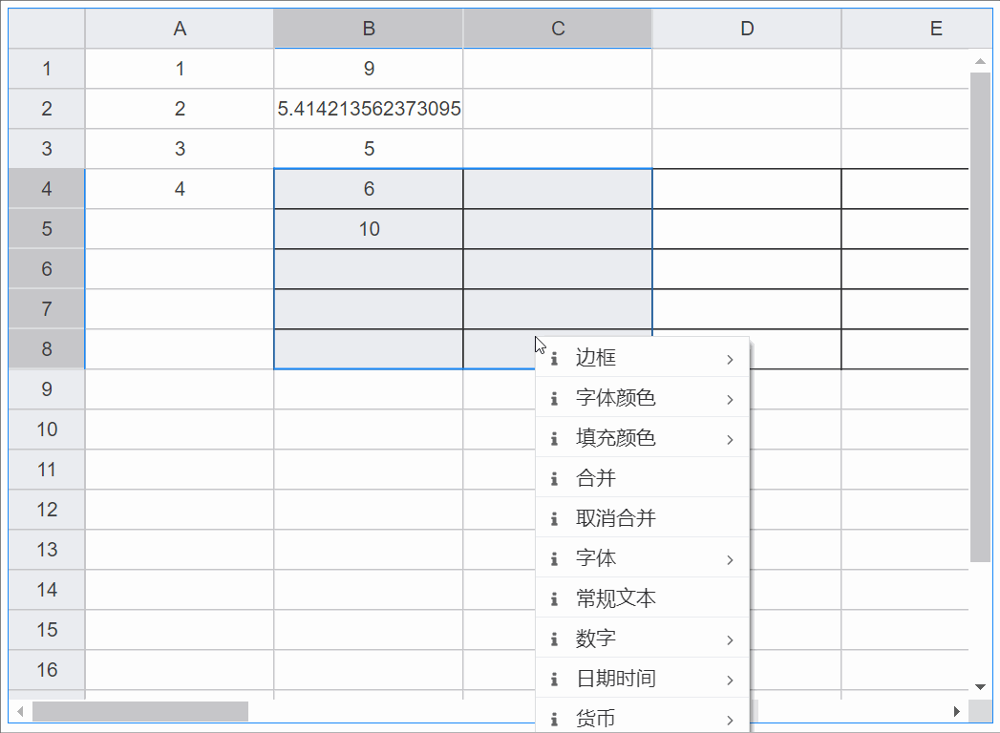

# 单元格边框

## 基础用法

<vma-formula-grid
:data="data"
:size="size"
:type="themeType"
style="width: 100%; height: 500px;"
/>

### 在数据配置中预设行/列、单元格的边框: 
- type: columns | rows | cells
- p: 列或列范围数组 | 行或行范围数组 | 单元格或单元格范围
- details: none | full | outer | inner | top | right | bottom | left
- 单条配置中优先级顺序: none > full > outer = inner > top = right = bottom = left
- borders数组若配置了多条规则，则优先级顺序: 后配置的总是会覆盖先配置的, 即从上至下优先级总是升高

::: code-group
```json
{
  "conf": {
    "borders": [
      { "p": ["A", "C", "D", "o:q"], "type": "columns", "details": { "full": true } },
      { "p": ["A"], "type": "columns", "details": { "none": true } },
      { "p": ["G"], "type": "columns", "details": { "left": true, "top": true, "bottom": true } },
      { "p": ["J", "K", "L"], "type": "columns", "details": { "outer": true } },
      { "p": "B4:E8", "type": "cells", "details": { "full": true } },
      { "p": "C5:D7", "type": "cells", "details": { "none": true } },
      { "p": [1, 5, 6, 7, 8], "type": "rows", "details": { "full": true } },
      { "p": [25, 26, "40:40"], "type": "rows", "details": { "outer": true } },
      { "p": "J28", "details": {}, "type": "cells" },
      { "p": "G7:K26", "details": { "full": true }, "type": "cells" },
      { "p": "J24:N30", "details": { "outer": true }, "type": "cells" },
      { "p": "J62:H60", "details": { "outer": true }, "type": "cells" }
    ]
  }
}
```
:::

### 在运行时动态设置单元格边框



<script lang="ts">
import {defineComponent, onMounted, reactive, ref, watch} from "vue";

export default defineComponent({
  name: "HelloWorld",
  setup() {
    const datasource = ref('map');
    const size = ref('normal');
    const themeType = ref('primary');

    onMounted(() => {
      console.log(data)
    });

    const mapData = reactive({
      data: [{
        p: 'A1',
        v: 1
      }, {
        p: 'A2',
        v: 2
      }, {
        p: 'A3',
        v: 3
      }, {
        p: 'A4',
        v: 4
      }, {
        p: 'A20',
        v: '= T20 - 2'
      }, {
        p: 'B1',
        v: '= SUM(A3, 6)'
      }, {
        p: 'B2',
        v: '= A2 + 2 + SQRT(2)'
      }, {
        p: 'B3',
        v: '= A3 + 2'
      }, {
        p: 'B4',
        v: '= A4 + 2'
      }, {
        p: 'B5',
        v: '= SUM(A1:A4)'
      }, {
        p: 'T20',
        v: '= A20 + 2'
      },]
    });

    const arrayData = reactive([
      [1, 2, 3, 4, 5, 6, 7, 8, 9, 10, 11, 12, 13, 14, 15, 16, 17, 18, 19, 20],
      [
        '= A1 + 2', '= B1 + 2', '= C1 + 2', '= D1 + 2', '= E1 + 2',
        '= F1 + 2', '= G1 + 2', '= H1 + 2', '= I1 + 2', '= J1 + 2',
        '= K1 + 2', '= L1 + 2', '= M1 + 2', '= N1 + 2', '= O1 + 2',
        '= P1 + 2', '= Q1 + 2', '= R1 + 2', '= S1 + 2', '= T1 + 2'
      ],
      [1, 2, 3, 4, 5, 6, 7, 8, 9, 10, 11, 12, 13, 14, 15, 16, 17, 18, 19, 20],
      [1, 2, 3, 4, 5, 6, 7, 8, 9, 10, 11, 12, 13, 14, 15, 16, 17, 18, 19, 20],
      [1, 2, 3, 4, 5, 6, 7, 8, 9, 10, 11, 12, 13, 14, 15, 16, 17, 18, 19, 20],
      [1, 2, 3, 4, 5, 6, 7, 8, 9, 10, 11, 12, 13, 14, 15, 16, 17, 18, 19, 20],
      [1, 2, 3, 4, 5, 6, 7, 8, 9, 10, 11, 12, 13, 14, 15, 16, 17, 18, 19, 20],
      [1, 2, 3, 4, 5, 6, 7, 8, 9, 10, 11, 12, 13, 14, 15, 16, 17, 18, 19, 20],
      [1, 2, 3, 4, 5, 6, 7, 8, 9, 10, 11, 12, 13, 14, 15, 16, 17, 18, 19, 20],
      [1, 2, 3, 4, 5, 6, 7, 8, 9, 10, 11, 12, 13, 14, 15, 16, 17, 18, 19, 20],
      [1, 2, 3, 4, 5, 6, 7, 8, 9, 10, 11, 12, 13, 14, 15, 16, 17, 18, 19, 20],
      [1, 2, 3, 4, 5, 6, 7, 8, 9, 10, 11, 12, 13, 14, 15, 16, 17, 18, 19, 20],
      [1, 2, 3, 4, 5, 6, 7, 8, 9, 10, 11, 12, 13, 14, 15, 16, 17, 18, 19, 20],
      [1, 2, 3, 4, 5, 6, 7, 8, 9, 10, 11, 12, 13, 14, 15, 16, 17, 18, 19, 20],
      [1, 2, 3, 4, 5, 6, 7, 8, 9, 10, 11, 12, 13, 14, 15, 16, 17, 18, 19, 20],
      [1, 2, 3, 4, 5, 6, 7, 8, 9, 10, 11, 12, 13, 14, 15, 16, 17, 18, 19, 20],
      [1, 2, 3, 4, 5, 6, 7, 8, 9, 10, 11, 12, 13, 14, 15, 16, 17, 18, 19, 20],
      [1, 2, 3, 4, 5, 6, 7, 8, 9, 10, 11, 12, 13, 14, 15, 16, 17, 18, 19, 20],
      [1, 2, 3, 4, 5, 6, 7, 8, 9, 10, 11, 12, 13, 14, 15, 16, 17, 18, 19, 20],
      [1, 2, 3, 4, 5, 6, 7, 8, 9, 10, 11, 12, 13, 14, 15, 16, 17, 18, 19, 20],
      [1, 2, 3, 4, 5, 6, 7, 8, 9, 10, 11, 12, 13, 14, 15, 16, 17, 18, 19, 20],
      [1, 2, 3, 4, 5, 6, 7, 8, 9, 10, 11, 12, 13, 14, 15, 16, 17, 18, 19, 20],
      [1, 2, 3, 4, 5, 6, 7, 8, 9, 10, 11, 12, 13, 14, 15, 16, 17, 18, 19, 20],
      [1, 2, 3, 4, 5, 6, 7, 8, 9, 10, 11, 12, 13, 14, 15, 16, 17, 18, 19, 20],
      [1, 2, 3, 4, 5, 6, 7, 8, 9, 10, 11, 12, 13, 14, 15, 16, 17, 18, 19, 20],
    ]);

    const confs = reactive({
      borders: [
        { p: ['G'], type: 'columns', details: { left: true, top: true, right: true, bottom: true } },
        { p: ['J', 'K', 'L'], type: 'columns', details: { outer: true } },
        { p: 'B4:E8', type: 'cells', details: { full: true } },
      ],
    });

    const data = reactive({
      conf: confs,
      type: 'map',
      arrayData: arrayData,
      mapData: mapData
    });

    watch(() => datasource.value, () => {
      data.type = datasource.value
    });

    watch(() => size.value, () => {
      console.log(size.value)
    });

    watch(() => data.type, () => {
      console.log(data)
    },{
      deep: true
    });

    return {
      datasource,
      data,
      size,
      themeType
    }
  }
})
</script>
