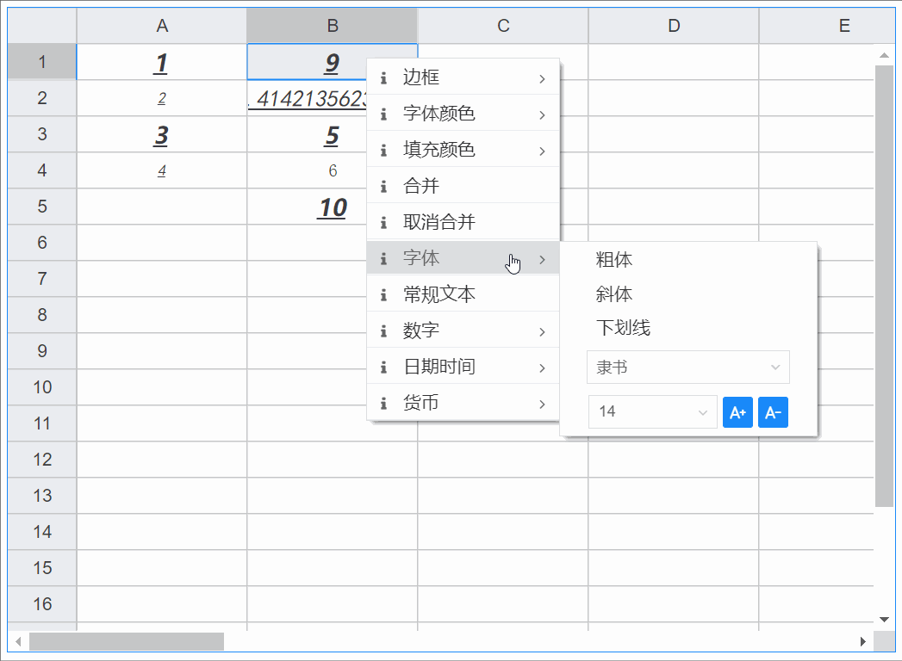

# 单元格字体样式

## 基础用法

<vma-formula-grid
:data="data"
:size="size"
:type="themeType"
style="width: 100%; height: 500px;"
/>

### 在数据配置中预设单元格的字体样式:
- type: columns | rows | cells
- p: 列或列范围数组 | 行或行范围数组 | 单元格或单元格范围
---
- 粗体 b
  - v: ture | false
  - b数组若配置了多条规则，则优先级顺序: 后配置的总是会覆盖先配置的, 即从上至下优先级总是升高
---
- 斜体 i
  - v: ture | false
  - i数组若配置了多条规则，则优先级顺序: 后配置的总是会覆盖先配置的, 即从上至下优先级总是升高
---
- 下划线 u
  - v: ture | false
  - u数组若配置了多条规则，则优先级顺序: 后配置的总是会覆盖先配置的, 即从上至下优先级总是升高
---
- 字体大小 fs
  - v: 非负整数, 单位为px/none(表示不指定任何字体大小，使用系统默认渲染)
  - fs数组若配置了多条规则，则优先级顺序: 后配置的总是会覆盖先配置的, 即从上至下优先级总是升高
---
- 字体 ff
  - v: 字符串, 见如下表格的预设值/none(表示不指定任何字体，使用系统默认渲染)
  - ff数组若配置了多条规则，则优先级顺序: 后配置的总是会覆盖先配置的, 即从上至下优先级总是升高
---
- 英文字体

| 名称          | 值                  | 名称               | 值               |
|:--------------|:-------------------|:-------------------|:-------------------|
| Andale Mono | andale mono,monospace | Arial | arial,helvetica,sans-serif |
| Arial Black | arial black,sans-serif | Book Antiqua | book antiqua,palatino,serif |
| Comic Sans MS | comic sans ms,sans-serif | Courier New | courier new,courier,monospace |
| Georgia | georgia,palatino,serif | Helvetica | helvetica,arial,sans-serif |
| Impact | impact,sans-serif | Symbol | symbol |
| Tahoma | tahoma,arial,helvetica,sans-serif | Terminal | terminal,monaco,monospace |
| Times New Roman | times new roman,times,serif | Terminal | terminal,monaco,monospace |
| Trebuchet MS | trebuchet ms,geneva,sans-serif | Verdana | verdana,geneva,sans-serif |
| Webdings | webdings | Wingdings | wingdings,zapf dingbats |

---
- 中文字体

```Windows```

| 名称          | 值                  | 名称               | 值               |
|:--------------|:-------------------|:-------------------|:-------------------|
| 宋体 | SimSun | 黑体 | SimHei |
| 微软雅黑 | Microsoft Yahei | 微软正黑体 | Microsoft JhengHei |
| 楷体 | KaiTi | 新宋体 | NSimSun |
| 仿宋 | FangSong |  |  |

```MacOS```

| 名称          | 值                  | 名称                 | 值                  |
|:--------------|:-------------------|:-------------------|:-------------------|
| 苹方 | PingFang SC | 华文黑体 | STHeiti |
| 华文楷体 | STKaiti | 华文宋体 | STSong |
| 华文仿宋 | STFangsong | 华文中宋 | STZhongsong |
| 华文琥珀 | STHupo | 华文新魏 | STXinwei |
| 华文隶书 | STLiti | 华文行楷 | STXingkai |
| 冬青黑体简 | Hiragino Sans GB | 兰亭黑-简 | Lantinghei SC |
| 翩翩体-简 | Hanzipen SC | 手札体-简 | Hannotate SC |
| 宋体-简 | Songti SC | 娃娃体-简 | Wawati SC |
| 魏碑-简 | Weibei SC | 行楷-简 | Xingkai SC |
| 雅痞-简 | Yapi SC | 圆体-简 | Yuanti SC |


```额外的office字体```

| 名称          | 值                  | 名称               | 值               |
|:--------------|:-------------------|:-------------------|:-------------------|
| 幼圆 | YouYuan | 隶书 | LiSu |
| 华文细黑 | STXihei | 华文楷体 | STKaiti |
| 华文宋体 | STSong | 华文仿宋 | STFangsong |
| 华文中宋 | STZhongsong | 华文彩云 | STCaiyun |
| 华文琥珀 | STHupo | 华文彩云 | STCaiyun |
| 华文新魏 | STXinwei | 华文隶书 | STLiti |
| 华文行楷 | STXingkai | 方正舒体 | FZShuTi |
| 方正姚体 | FZYaoti |  |  |

```开源字体```

| 名称          | 值                  | 名称               | 值               |
|:--------------|:-------------------|:-------------------|:-------------------|
| 思源黑体 | Source Han Sans CN | 思源宋体 | Source Han Serif SC |
| 文泉驿微米黑 | WenQuanYi Micro Hei |  |  |

::: code-group
```json
{
  "conf": {
    "styles": {
      "b": [
        { "p": ["A", "C", "D", "o:r"], "type": "columns", "v": true },
        { "p": ["B", "D", "F"], "type": "columns", "v": true },
        { "p": [1, 3, 5], "type": "rows", "v": true },
        { "p": [10, 11, 12, "23:27"], "type": "rows", "v": true },
        { "p": "L26:G7", "type": "cells", "v": true },
        { "p": "J20", "type": "cells", "v": true },
        { "p": "J23", "type": "cells", "v": true }
      ],
      "i": [
        { "p": ["A", "C", "D", "o:r"], "type": "columns", "v": true },
        { "p": ["B", "D", "F"], "type": "columns", "v": true },
        { "p": [1, 3, 5], "type": "rows", "v": true },
        { "p": [10, 11, 12, "23:27"], "type": "rows", "v": true },
        { "p": "L26:G7", "type": "cells", "v": true },
        { "p": "J20", "type": "cells", "v": true },
        { "p": "J23", "type": "cells", "v": true }
      ],
      "u": [
        { "p": ["A", "C", "D", "o:r"], "type": "columns", "v": true },
        { "p": ["B", "D", "F"], "type": "columns", "v": true },
        { "p": [1, 3, 5], "type": "rows", "v": true },
        { "p": [10, 11, 12, "23:27"], "type": "rows", "v": true },
        { "p": "L26:G7", "type": "cells", "v": true },
        { "p": "J20", "type": "cells", "v": true },
        { "p": "J23", "type": "cells", "v": true }
      ],
      "fs": [
        { "p": ["A", "C", "D", "o:r"], "type": "columns", "v": 12 },
        { "p": ["B", "D", "F"], "type": "columns", "v": 18 },
        { "p": [1, 3, 5], "type": "rows", "v": 18 },
        { "p": [10, 11, 12, "23:27"], "type": "rows", "v": 16 },
        { "p": "L26:G7", "type": "cells", "v": 28 },
        { "p": "J20", "type": "cells", "v": "none" },
        { "p": "J23", "type": "cells", "v": 36 }
      ],
      "ff": [
        { "p": ["A", "C", "D", "o:r"], "type": "columns", "v": "黑体" },
        { "p": ["B", "D", "F"], "type": "columns", "v": "楷体" },
        { "p": [1, 3, 5], "type": "rows", "v": "微软雅黑" },
        { "p": [10, 11, 12, "23:27"], "type": "rows", "v": "微软雅黑" },
        { "p": "L26:G7", "type": "cells", "v": "微软雅黑" },
        { "p": "J20", "type": "cells", "v": "none" },
        { "p": "J23", "type": "cells", "v": "仿宋" }
      ]
    }
  }
}
```
:::

### 在运行时动态设置单元格字体样式



<script lang="ts">
import {defineComponent, onMounted, reactive, ref, watch} from "vue";

export default defineComponent({
  name: "HelloWorld",
  setup() {
    const datasource = ref('map');
    const size = ref('normal');
    const themeType = ref('primary');

    onMounted(() => {
      console.log(data)
    });

    const mapData = reactive({
      data: [{
        p: 'A1',
        v: 1
      }, {
        p: 'A2',
        v: 2
      }, {
        p: 'A3',
        v: 3
      }, {
        p: 'A4',
        v: 4
      }, {
        p: 'A20',
        v: '= T20 - 2'
      }, {
        p: 'B1',
        v: '= SUM(A3, 6)'
      }, {
        p: 'B2',
        v: '= A2 + 2 + SQRT(2)'
      }, {
        p: 'B3',
        v: '= A3 + 2'
      }, {
        p: 'B4',
        v: '= A4 + 2'
      }, {
        p: 'B5',
        v: '= SUM(A1:A4)'
      }, {
        p: 'T20',
        v: '= A20 + 2'
      },]
    });

    const arrayData = reactive([
      [1, 2, 3, 4, 5, 6, 7, 8, 9, 10, 11, 12, 13, 14, 15, 16, 17, 18, 19, 20],
      [
        '= A1 + 2', '= B1 + 2', '= C1 + 2', '= D1 + 2', '= E1 + 2',
        '= F1 + 2', '= G1 + 2', '= H1 + 2', '= I1 + 2', '= J1 + 2',
        '= K1 + 2', '= L1 + 2', '= M1 + 2', '= N1 + 2', '= O1 + 2',
        '= P1 + 2', '= Q1 + 2', '= R1 + 2', '= S1 + 2', '= T1 + 2'
      ],
      [1, 2, 3, 4, 5, 6, 7, 8, 9, 10, 11, 12, 13, 14, 15, 16, 17, 18, 19, 20],
      [1, 2, 3, 4, 5, 6, 7, 8, 9, 10, 11, 12, 13, 14, 15, 16, 17, 18, 19, 20],
      [1, 2, 3, 4, 5, 6, 7, 8, 9, 10, 11, 12, 13, 14, 15, 16, 17, 18, 19, 20],
      [1, 2, 3, 4, 5, 6, 7, 8, 9, 10, 11, 12, 13, 14, 15, 16, 17, 18, 19, 20],
      [1, 2, 3, 4, 5, 6, 7, 8, 9, 10, 11, 12, 13, 14, 15, 16, 17, 18, 19, 20],
      [1, 2, 3, 4, 5, 6, 7, 8, 9, 10, 11, 12, 13, 14, 15, 16, 17, 18, 19, 20],
      [1, 2, 3, 4, 5, 6, 7, 8, 9, 10, 11, 12, 13, 14, 15, 16, 17, 18, 19, 20],
      [1, 2, 3, 4, 5, 6, 7, 8, 9, 10, 11, 12, 13, 14, 15, 16, 17, 18, 19, 20],
      [1, 2, 3, 4, 5, 6, 7, 8, 9, 10, 11, 12, 13, 14, 15, 16, 17, 18, 19, 20],
      [1, 2, 3, 4, 5, 6, 7, 8, 9, 10, 11, 12, 13, 14, 15, 16, 17, 18, 19, 20],
      [1, 2, 3, 4, 5, 6, 7, 8, 9, 10, 11, 12, 13, 14, 15, 16, 17, 18, 19, 20],
      [1, 2, 3, 4, 5, 6, 7, 8, 9, 10, 11, 12, 13, 14, 15, 16, 17, 18, 19, 20],
      [1, 2, 3, 4, 5, 6, 7, 8, 9, 10, 11, 12, 13, 14, 15, 16, 17, 18, 19, 20],
      [1, 2, 3, 4, 5, 6, 7, 8, 9, 10, 11, 12, 13, 14, 15, 16, 17, 18, 19, 20],
      [1, 2, 3, 4, 5, 6, 7, 8, 9, 10, 11, 12, 13, 14, 15, 16, 17, 18, 19, 20],
      [1, 2, 3, 4, 5, 6, 7, 8, 9, 10, 11, 12, 13, 14, 15, 16, 17, 18, 19, 20],
      [1, 2, 3, 4, 5, 6, 7, 8, 9, 10, 11, 12, 13, 14, 15, 16, 17, 18, 19, 20],
      [1, 2, 3, 4, 5, 6, 7, 8, 9, 10, 11, 12, 13, 14, 15, 16, 17, 18, 19, 20],
      [1, 2, 3, 4, 5, 6, 7, 8, 9, 10, 11, 12, 13, 14, 15, 16, 17, 18, 19, 20],
      [1, 2, 3, 4, 5, 6, 7, 8, 9, 10, 11, 12, 13, 14, 15, 16, 17, 18, 19, 20],
      [1, 2, 3, 4, 5, 6, 7, 8, 9, 10, 11, 12, 13, 14, 15, 16, 17, 18, 19, 20],
      [1, 2, 3, 4, 5, 6, 7, 8, 9, 10, 11, 12, 13, 14, 15, 16, 17, 18, 19, 20],
      [1, 2, 3, 4, 5, 6, 7, 8, 9, 10, 11, 12, 13, 14, 15, 16, 17, 18, 19, 20],
    ]);

    const confs = reactive({
      "styles": {
        "b": [
          { "p": ["A", "C", "D", "o:r"], "type": "columns", "v": true },
          { "p": ["B", "D", "F"], "type": "columns", "v": true },
          { "p": [1, 3, 5], "type": "rows", "v": true },
          { "p": [10, 11, 12, "23:27"], "type": "rows", "v": true },
          { "p": "L26:G7", "type": "cells", "v": true },
          { "p": "J20", "type": "cells", "v": true },
          { "p": "J23", "type": "cells", "v": true }
        ],
        "i": [
          { "p": ["A", "C", "D", "o:r"], "type": "columns", "v": true },
          { "p": ["B", "D", "F"], "type": "columns", "v": true },
          { "p": [1, 3, 5], "type": "rows", "v": true },
          { "p": [10, 11, 12, "23:27"], "type": "rows", "v": true },
          { "p": "L26:G7", "type": "cells", "v": true },
          { "p": "J20", "type": "cells", "v": true },
          { "p": "J23", "type": "cells", "v": true }
        ],
        "u": [
          { "p": ["A", "C", "D", "o:r"], "type": "columns", "v": true },
          { "p": ["B", "D", "F"], "type": "columns", "v": true },
          { "p": [1, 3, 5], "type": "rows", "v": true },
          { "p": [10, 11, 12, "23:27"], "type": "rows", "v": true },
          { "p": "L26:G7", "type": "cells", "v": true },
          { "p": "J20", "type": "cells", "v": true },
          { "p": "J23", "type": "cells", "v": true }
        ],
        "fs": [
          { "p": ["A", "C", "D", "o:r"], "type": "columns", "v": 12 },
          { "p": ["B", "D", "F"], "type": "columns", "v": 18 },
          { "p": [1, 3, 5], "type": "rows", "v": 18 },
          { "p": [10, 11, 12, "23:27"], "type": "rows", "v": 16 },
          { "p": "L26:G7", "type": "cells", "v": 28 },
          { "p": "J20", "type": "cells", "v": "none" },
          { "p": "J23", "type": "cells", "v": 36 }
        ],
        "ff": [
          { "p": ["A", "C", "D", "o:r"], "type": "columns", "v": "黑体" },
          { "p": ["B", "D", "F"], "type": "columns", "v": "楷体" },
          { "p": [1, 3, 5], "type": "rows", "v": "微软雅黑" },
          { "p": [10, 11, 12, "23:27"], "type": "rows", "v": "微软雅黑" },
          { "p": "L26:G7", "type": "cells", "v": "微软雅黑" },
          { "p": "J20", "type": "cells", "v": "none" },
          { "p": "J23", "type": "cells", "v": "仿宋" }
        ]
      }
    });

    const data = reactive({
      conf: confs,
      type: 'map',
      arrayData: arrayData,
      mapData: mapData
    });

    watch(() => datasource.value, () => {
      data.type = datasource.value
    });

    watch(() => size.value, () => {
      console.log(size.value)
    });

    watch(() => data.type, () => {
      console.log(data)
    },{
      deep: true
    });

    return {
      datasource,
      data,
      size,
      themeType
    }
  }
})
</script>
