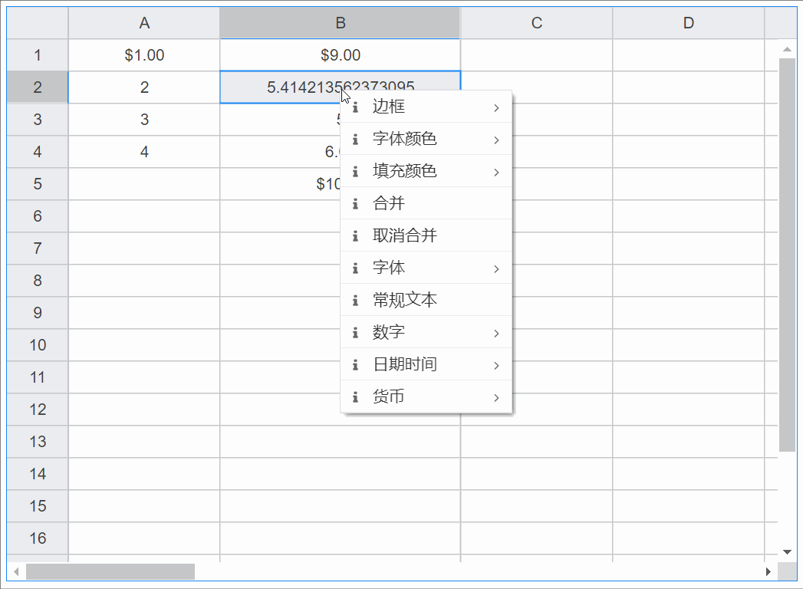

# 单元格背景颜色

## 基础用法

<vma-formula-grid
:data="data"
:size="size"
:type="themeType"
style="width: 100%; height: 500px;"
/>

### 在数据配置中预设<u>全局</u>单元格的格式:

```即使不配置全局的单元格格式, 也将会有一组系统预设值可以使用```

```优先级高于系统预设的单元格格式```

---

- g: 普通格式, 通常不用设置, 使用系统默认渲染

---

- n: 数字格式

```general```
  一般数字格式

```percent```
  百分比数字格式

```science```
  科学计数法数字格式

```fraction```
  分数数字格式

```thousands```
  千分数字格式

---

- d: 日期时间格式

```time```
  时间格式

```shortDate```
  短日期格式

```longDate```
  长日期格式

---

- c: 货币格式

```cny```
  人民币格式

```usd```
  美元格式

```euro```
  欧元格式

```others```
  其他货币格式, 可配置key/value数组

---

::: code-group
```json
{
  "conf": {
    "global": {
      "formats": {
        "n": {
          "general": "0.00",
          "percent": "0.00%",
          "science": "0.00E+0",
          "fraction": "0/0",
          "thousands": "###,###"
        },
        "d": {
          "time": "hh:mm:ss AM/PM",
          "shortDate": "yyyy-mm-dd dddd",
          "longDate": "yyyy-mm-dd hh:mm:ss AM/PM"
        },
        "c": {
          "cny": "#,##0.00\" ¥\"",
          "usd": "$#,##0.00",
          "euro": "#,##0\" €\"",
          "others": [
            { "key": "英镑", "value": "\"£ \"#,##0.00" },
            { "key": "韩元", "value": "\"₩ \"#,##0.00" }
          ]
        }
      }
    }
  }
}
```
:::

### 在数据配置中预设单元格的格式

```优先级高于预设的全局单元格格式```

- type: columns | rows | cells
- p: 列或列范围数组 | 行或行范围数组 | 单元格或单元格范围
- details: type: g | n | d | c, v: 格式string
- formats数组若配置了多条规则，则优先级顺序: 后配置的总是会覆盖先配置的, 即从上至下优先级总是升高

::: code-group
```json
{
  "conf": {
    "formats": [
      { "p": ["A", "C", "D", "o:q"], "type": "columns", "details": { "type": "g" } },
      { "p": "B4:E8", "type": "cells", "details": { "type": "n", "v": "##.00" } },
      { "p": "C15:D17", "type": "cells", "details": { "type": "n", "v": "###,###.00" } },
      { "p": "J28", "type": "cells", "details": { "type": "n", "v": "##0/##0" } },
      { "p": "G7:K26", "type": "cells", "details": { "type": "n", "v": "0.0%" } },
      { "p": [1, 5, 6, 7, 8], "type": "rows", "details": { "type": "c", "v": "$#,##0.00" } },
      { "p": "L61", "type": "cells", "details": { "type": "c", "v": "#,##0.00\" ￥\"" } },
      { "p": "C6:D7", "type": "cells", "details": { "type": "d", "v": "yyyy-mm-dd dddd" } },
      { "p": "E10:F17", "type": "cells", "details": { "type": "d", "v": "yyyy-mm-dd hh:mm AM/PM" } }
    ]
  }
}
```
:::

### 在运行时动态设置单元格格式



<script lang="ts">
import {defineComponent, onMounted, reactive, ref, watch} from "vue";

export default defineComponent({
  name: "HelloWorld",
  setup() {
    const datasource = ref('map');
    const size = ref('normal');
    const themeType = ref('primary');

    onMounted(() => {
      console.log(data)
    });

    const mapData = reactive({
      data: [{
        p: 'A1',
        v: 1
      }, {
        p: 'A2',
        v: 2
      }, {
        p: 'A3',
        v: 3
      }, {
        p: 'A4',
        v: 4
      }, {
        p: 'A20',
        v: '= T20 - 2'
      }, {
        p: 'B1',
        v: '= SUM(A3, 6)'
      }, {
        p: 'B2',
        v: '= A2 + 2 + SQRT(2)'
      }, {
        p: 'B3',
        v: '= A3 + 2'
      }, {
        p: 'B4',
        v: '= A4 + 2'
      }, {
        p: 'B5',
        v: '= SUM(A1:A4)'
      }, {
        p: 'T20',
        v: '= A20 + 2'
      },]
    });

    const arrayData = reactive([
      [1, 2, 3, 4, 5, 6, 7, 8, 9, 10, 11, 12, 13, 14, 15, 16, 17, 18, 19, 20],
      [
        '= A1 + 2', '= B1 + 2', '= C1 + 2', '= D1 + 2', '= E1 + 2',
        '= F1 + 2', '= G1 + 2', '= H1 + 2', '= I1 + 2', '= J1 + 2',
        '= K1 + 2', '= L1 + 2', '= M1 + 2', '= N1 + 2', '= O1 + 2',
        '= P1 + 2', '= Q1 + 2', '= R1 + 2', '= S1 + 2', '= T1 + 2'
      ],
      [1, 2, 3, 4, 5, 6, 7, 8, 9, 10, 11, 12, 13, 14, 15, 16, 17, 18, 19, 20],
      [1, 2, 3, 4, 5, 6, 7, 8, 9, 10, 11, 12, 13, 14, 15, 16, 17, 18, 19, 20],
      [1, 2, 3, 4, 5, 6, 7, 8, 9, 10, 11, 12, 13, 14, 15, 16, 17, 18, 19, 20],
      [1, 2, 3, 4, 5, 6, 7, 8, 9, 10, 11, 12, 13, 14, 15, 16, 17, 18, 19, 20],
      [1, 2, 3, 4, 5, 6, 7, 8, 9, 10, 11, 12, 13, 14, 15, 16, 17, 18, 19, 20],
      [1, 2, 3, 4, 5, 6, 7, 8, 9, 10, 11, 12, 13, 14, 15, 16, 17, 18, 19, 20],
      [1, 2, 3, 4, 5, 6, 7, 8, 9, 10, 11, 12, 13, 14, 15, 16, 17, 18, 19, 20],
      [1, 2, 3, 4, 5, 6, 7, 8, 9, 10, 11, 12, 13, 14, 15, 16, 17, 18, 19, 20],
      [1, 2, 3, 4, 5, 6, 7, 8, 9, 10, 11, 12, 13, 14, 15, 16, 17, 18, 19, 20],
      [1, 2, 3, 4, 5, 6, 7, 8, 9, 10, 11, 12, 13, 14, 15, 16, 17, 18, 19, 20],
      [1, 2, 3, 4, 5, 6, 7, 8, 9, 10, 11, 12, 13, 14, 15, 16, 17, 18, 19, 20],
      [1, 2, 3, 4, 5, 6, 7, 8, 9, 10, 11, 12, 13, 14, 15, 16, 17, 18, 19, 20],
      [1, 2, 3, 4, 5, 6, 7, 8, 9, 10, 11, 12, 13, 14, 15, 16, 17, 18, 19, 20],
      [1, 2, 3, 4, 5, 6, 7, 8, 9, 10, 11, 12, 13, 14, 15, 16, 17, 18, 19, 20],
      [1, 2, 3, 4, 5, 6, 7, 8, 9, 10, 11, 12, 13, 14, 15, 16, 17, 18, 19, 20],
      [1, 2, 3, 4, 5, 6, 7, 8, 9, 10, 11, 12, 13, 14, 15, 16, 17, 18, 19, 20],
      [1, 2, 3, 4, 5, 6, 7, 8, 9, 10, 11, 12, 13, 14, 15, 16, 17, 18, 19, 20],
      [1, 2, 3, 4, 5, 6, 7, 8, 9, 10, 11, 12, 13, 14, 15, 16, 17, 18, 19, 20],
      [1, 2, 3, 4, 5, 6, 7, 8, 9, 10, 11, 12, 13, 14, 15, 16, 17, 18, 19, 20],
      [1, 2, 3, 4, 5, 6, 7, 8, 9, 10, 11, 12, 13, 14, 15, 16, 17, 18, 19, 20],
      [1, 2, 3, 4, 5, 6, 7, 8, 9, 10, 11, 12, 13, 14, 15, 16, 17, 18, 19, 20],
      [1, 2, 3, 4, 5, 6, 7, 8, 9, 10, 11, 12, 13, 14, 15, 16, 17, 18, 19, 20],
      [1, 2, 3, 4, 5, 6, 7, 8, 9, 10, 11, 12, 13, 14, 15, 16, 17, 18, 19, 20],
    ]);

    const confs = reactive({
      global: {
        formats: {
          n: {
            general: '0.00',
            percent: '0.00%',
            science: '0.00E+0',
            fraction: '0/0',
            thousands: '###,###',
          },
          d: {
            time: 'hh:mm:ss AM/PM',
            shortDate: 'yyyy-mm-dd dddd',
            longDate: 'yyyy-mm-dd hh:mm:ss AM/PM',
          },
          c: {
            cny: '#,##0.00" ¥"',
            usd: '$#,##0.00',
            euro: '#,##0" €"',
            others: [
               { key: '英镑', value: '"£ "#,##0.00' },
               { key: '韩元', value: '"₩ "#,##0.00' },
            ],
          },
        },
      },
      formats: [
        { p: ['A', 'C', 'D', 'o:q'], type: 'columns', details: { type: 'g' } },
        { p: 'B4:E8', type: 'cells', details: { type: 'n', v: '##.00' } },
        { p: 'C15:D17', type: 'cells', details: { type: 'n', v: '###,###.00' } },
        { p: 'J28', type: 'cells', details: { type: 'n', v: '##0/##0' } },
        { p: 'G7:K26', type: 'cells', details: { type: 'n', v: '0.0%' } },
        { p: [1, 5, 6, 7, 8], type: 'rows', details: { type: 'c', v: '$#,##0.00' } },
        { p: 'L61', type: 'cells', details: { type: 'c', v: '#,##0.00" ¥"' } },
        { p: 'C6:D7', type: 'cells', details: { type: 'd', v: 'yyyy-mm-dd dddd' } },
        { p: 'E10:F17', type: 'cells', details: { type: 'd', v: 'yyyy-mm-dd hh:mm AM/PM' } },
      ],
    });

    const data = reactive({
      conf: confs,
      type: 'map',
      arrayData: arrayData,
      mapData: mapData
    });

    watch(() => datasource.value, () => {
      data.type = datasource.value
    });

    watch(() => size.value, () => {
      console.log(size.value)
    });

    watch(() => data.type, () => {
      console.log(data)
    },{
      deep: true
    });

    return {
      datasource,
      data,
      size,
      themeType
    }
  }
})
</script>

