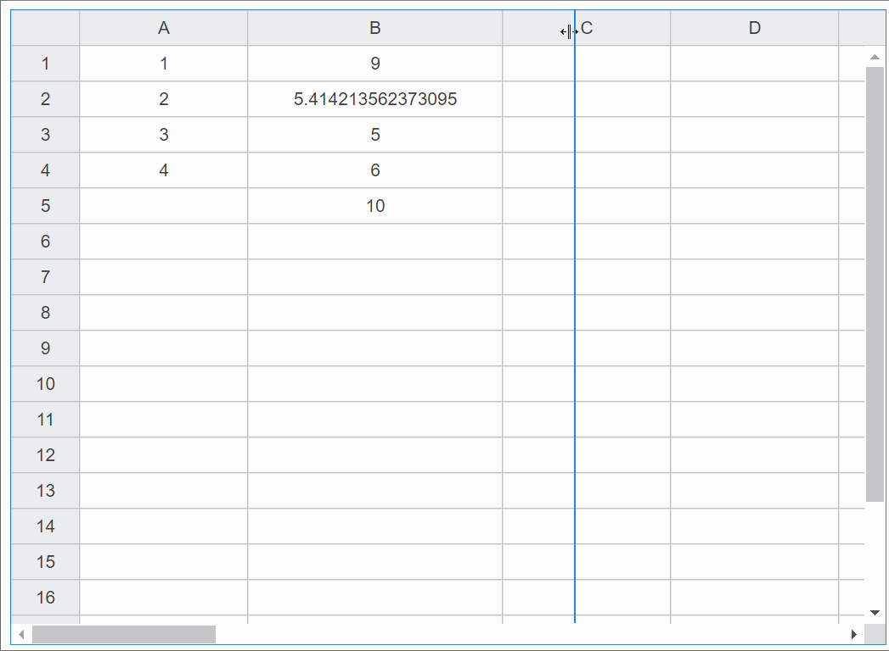
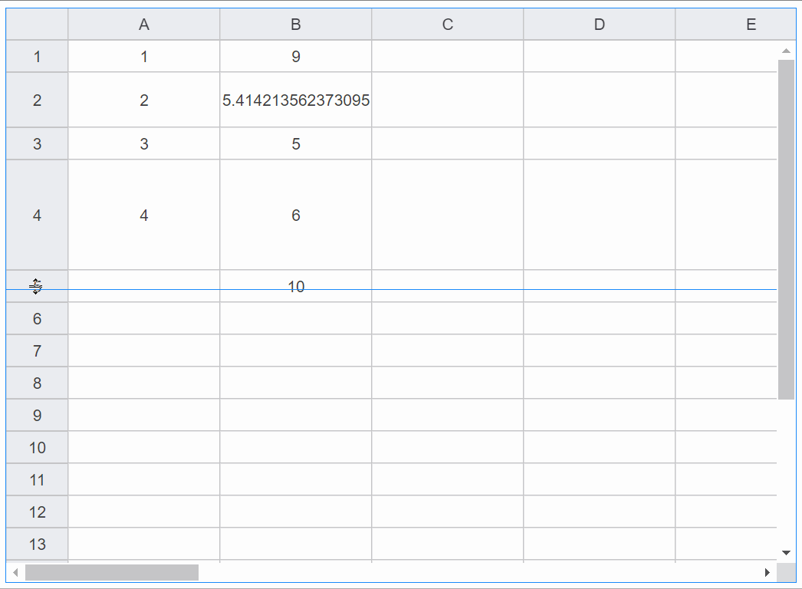

# 列宽行高

## 列宽

<vma-formula-grid
:data="data"
:size="size"
style="width: 100%; height: 500px;"
/>

- 可以在数据配置中预设列的width: 取值为非负整数, 单位为px

::: code-group
```json
{
  "conf": {
    "colWidth": [
      {
        "col": "B",
        "width": 200
      },
      {
        "col": "H",
        "width": 200
      }
    ]
  }
}
```
:::

- 可以在运行时动态调整列宽



## 行高

<vma-formula-grid
:data="data1"
:size="size"
style="width: 100%; height: 500px;"
/>

- 可以在数据配置中预设行的height: 取值为整数, 单位为px

::: code-group
```json
{
  "conf": {
    "rowHeight": [
      {
        "row": 2,
        "height": 48
      },
      {
        "row": 4,
        "height": 96
      }
    ]
  }
}
```
:::

- 可以在运行时动态调整行高



<script lang="ts">
import {defineComponent, onMounted, reactive, ref, watch} from "vue";

export default defineComponent({
  name: "HelloWorld",
  setup() {
    const size = ref('normal');

    onMounted(() => {
      console.log(data)
    });

    const mapData = reactive({
      data: [{
        p: 'A1',
        v: 1
      }, {
        p: 'A2',
        v: 2
      }, {
        p: 'A3',
        v: 3
      }, {
        p: 'A4',
        v: 4
      }, {
        p: 'A20',
        v: '= T20 - 2'
      }, {
        p: 'B1',
        v: '= SUM(A3, 6)'
      }, {
        p: 'B2',
        v: '= A2 + 2 + SQRT(2)'
      }, {
        p: 'B3',
        v: '= A3 + 2'
      }, {
        p: 'B4',
        v: '= A4 + 2'
      }, {
        p: 'B5',
        v: '= SUM(A1:A4)'
      }, {
        p: 'T20',
        v: '= A20 + 2'
      },]
    });

    const arrayData = reactive([
      [1, 2, 3, 4, 5, 6, 7, 8, 9, 10, 11, 12, 13, 14, 15, 16, 17, 18, 19, 20],
      [
        '= A1 + 2', '= B1 + 2', '= C1 + 2', '= D1 + 2', '= E1 + 2',
        '= F1 + 2', '= G1 + 2', '= H1 + 2', '= I1 + 2', '= J1 + 2',
        '= K1 + 2', '= L1 + 2', '= M1 + 2', '= N1 + 2', '= O1 + 2',
        '= P1 + 2', '= Q1 + 2', '= R1 + 2', '= S1 + 2', '= T1 + 2'
      ],
      [1, 2, 3, 4, 5, 6, 7, 8, 9, 10, 11, 12, 13, 14, 15, 16, 17, 18, 19, 20],
      [1, 2, 3, 4, 5, 6, 7, 8, 9, 10, 11, 12, 13, 14, 15, 16, 17, 18, 19, 20],
      [1, 2, 3, 4, 5, 6, 7, 8, 9, 10, 11, 12, 13, 14, 15, 16, 17, 18, 19, 20],
      [1, 2, 3, 4, 5, 6, 7, 8, 9, 10, 11, 12, 13, 14, 15, 16, 17, 18, 19, 20],
      [1, 2, 3, 4, 5, 6, 7, 8, 9, 10, 11, 12, 13, 14, 15, 16, 17, 18, 19, 20],
      [1, 2, 3, 4, 5, 6, 7, 8, 9, 10, 11, 12, 13, 14, 15, 16, 17, 18, 19, 20],
      [1, 2, 3, 4, 5, 6, 7, 8, 9, 10, 11, 12, 13, 14, 15, 16, 17, 18, 19, 20],
      [1, 2, 3, 4, 5, 6, 7, 8, 9, 10, 11, 12, 13, 14, 15, 16, 17, 18, 19, 20],
      [1, 2, 3, 4, 5, 6, 7, 8, 9, 10, 11, 12, 13, 14, 15, 16, 17, 18, 19, 20],
      [1, 2, 3, 4, 5, 6, 7, 8, 9, 10, 11, 12, 13, 14, 15, 16, 17, 18, 19, 20],
      [1, 2, 3, 4, 5, 6, 7, 8, 9, 10, 11, 12, 13, 14, 15, 16, 17, 18, 19, 20],
      [1, 2, 3, 4, 5, 6, 7, 8, 9, 10, 11, 12, 13, 14, 15, 16, 17, 18, 19, 20],
      [1, 2, 3, 4, 5, 6, 7, 8, 9, 10, 11, 12, 13, 14, 15, 16, 17, 18, 19, 20],
      [1, 2, 3, 4, 5, 6, 7, 8, 9, 10, 11, 12, 13, 14, 15, 16, 17, 18, 19, 20],
      [1, 2, 3, 4, 5, 6, 7, 8, 9, 10, 11, 12, 13, 14, 15, 16, 17, 18, 19, 20],
      [1, 2, 3, 4, 5, 6, 7, 8, 9, 10, 11, 12, 13, 14, 15, 16, 17, 18, 19, 20],
      [1, 2, 3, 4, 5, 6, 7, 8, 9, 10, 11, 12, 13, 14, 15, 16, 17, 18, 19, 20],
      [1, 2, 3, 4, 5, 6, 7, 8, 9, 10, 11, 12, 13, 14, 15, 16, 17, 18, 19, 20],
      [1, 2, 3, 4, 5, 6, 7, 8, 9, 10, 11, 12, 13, 14, 15, 16, 17, 18, 19, 20],
      [1, 2, 3, 4, 5, 6, 7, 8, 9, 10, 11, 12, 13, 14, 15, 16, 17, 18, 19, 20],
      [1, 2, 3, 4, 5, 6, 7, 8, 9, 10, 11, 12, 13, 14, 15, 16, 17, 18, 19, 20],
      [1, 2, 3, 4, 5, 6, 7, 8, 9, 10, 11, 12, 13, 14, 15, 16, 17, 18, 19, 20],
      [1, 2, 3, 4, 5, 6, 7, 8, 9, 10, 11, 12, 13, 14, 15, 16, 17, 18, 19, 20],
    ]);

    const confs = reactive({
        colWidth: [
            { col: 'B', width: 200 },
            { col: 'H', width: 200 },
        ],
    });

    const confs1 = reactive({
        rowHeight: [
            { row: 2, height: 48 },
            { row: 4, height: 96 },
        ],
    });

    const data = reactive({
      conf: confs,
      type: 'map',
      arrayData: arrayData,
      mapData: mapData
    });

    const data1 = reactive({
      conf: confs1,
      type: 'map',
      arrayData: arrayData,
      mapData: mapData
    });

    return {
      data,
      data1,
      size
    }
  }
})
</script>

<style scoped>
.fieldset {
    border: none;
    display: inline-block;
    vertical-align: top; /* enter your desired option */

    > span {
        margin-right: 10px;
    }
}
</style>